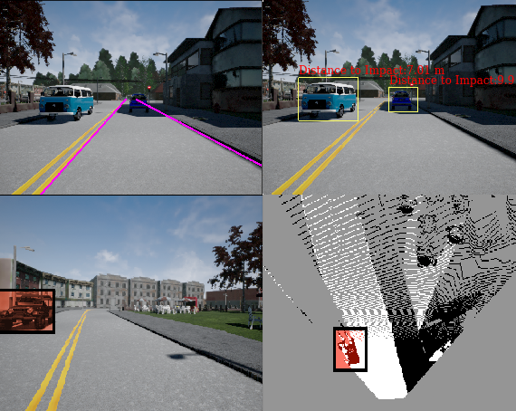

# Self-Driving Car Specialization
This repo contains my Coursera Self-Driving Car Specialization' class materials, project results and the key topics of each course.

## 1. Introduction to Self-Driving Cars
- Taxonomy of self-driving cars
- Driving decisions and actions
- Hardware and software stacks
- Safety assessment and industry approach
- Kinematic and dynamic modeling
- Longitudinal and lateral controller design
- Control stack on CARLA racetrack
  
[</img>](https://youtu.be/pvThPqJ2_lo?feature=shared)

## 2. State Estimation and Localization for Self-Driving Cars
- Squared error optimization and Least squares
- The linear, extended, error-state and unscented kalman filters
- Pose estimation with GNSS/INS
- Lidar sensing and point clouds
- Vehicle state estimator
  
## 3. Visual Perception for Self-Driving Cars
- Basics of 3D computer vision
- Visual Features
- Feedforward and CNN
- 2D object detection
- Semantic segmentation

## 4. Motion Planning for Self-Driving Cars
- Decompose the motion planning problem into a hierarchical structure
- Static occupancy grids
- Mission planning on road networks
- Reactive planning and collision checking
- Behavioral planning
- Smooth local planning
- Motion planning in CARLA simulation
  
[</img>](https://youtu.be/nvQEh_HwXmw?feature=shared)